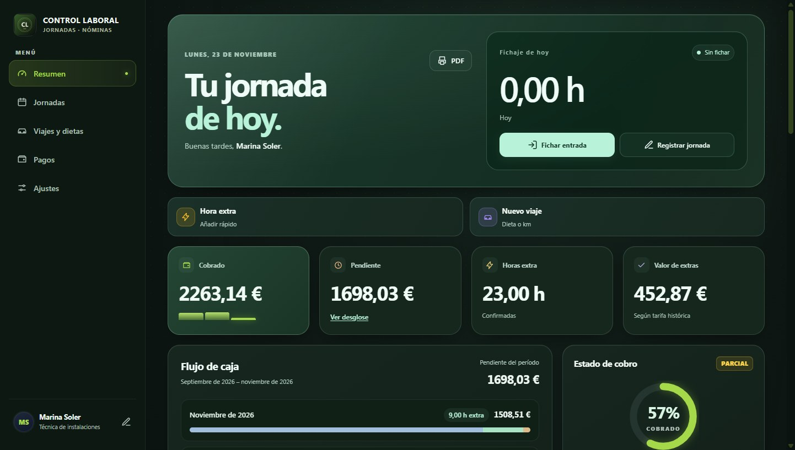
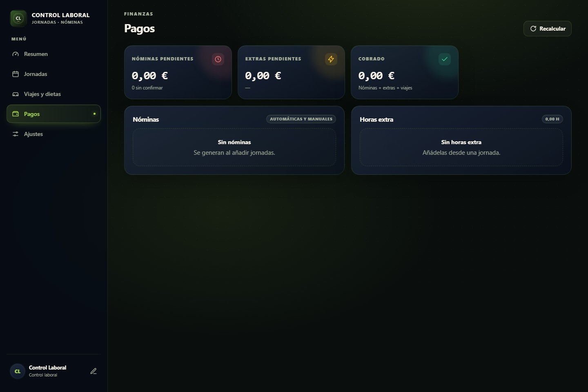
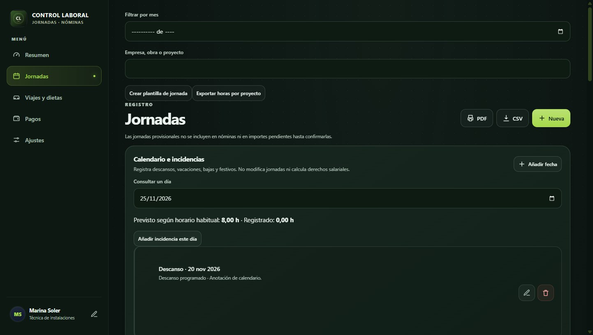
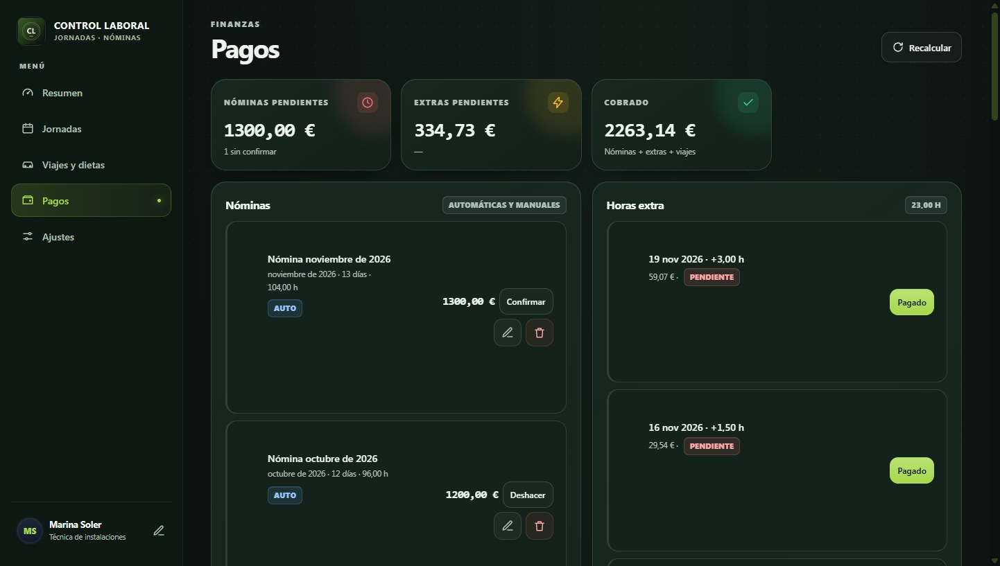
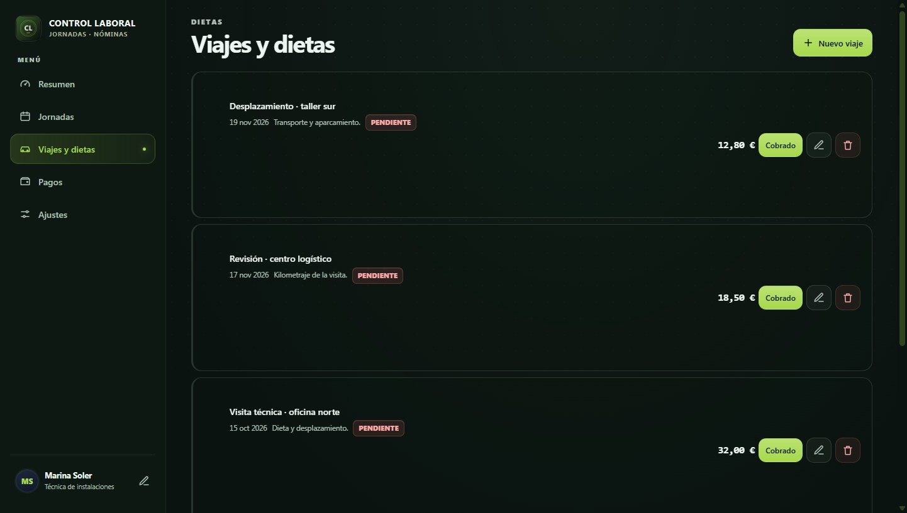

<p align="center">
  
</p>

<h1 align="center">Control Laboral</h1>
<p align="center"><strong>Registra tu trabajo. Comprueba tus horas. Revisa tus cobros.</strong></p>
<p align="center">Una aplicación creada por <strong>工V龱尺ㄚ㇌7</strong></p>

<p align="center">
  <a href="https://ivory37goku.github.io/ivory37-control-laboral/"><strong>Abrir Control Laboral</strong></a>
  &nbsp;·&nbsp; <a href="#galería-de-la-aplicación">Ver capturas</a>
  &nbsp;·&nbsp; <a href="#instalación">Instalar</a>
  &nbsp;·&nbsp; <a href="CHANGELOG.md">Novedades</a>
</p>

<p align="center">
  
  
  
  
  
</p>

Control Laboral reúne el fichaje diario, las horas extra, las nóminas y los desplazamientos. Su panel **Aurora** permite revisar la jornada y los cobros de un vistazo, con una comparativa mensual para comprobar cuánto corresponde por tarifa y cuánto has recibido.

**Disponible como APK para Android, instalador EXE para Windows y aplicación web instalable.** Los registros se guardan en el dispositivo y la sincronización entre instalaciones es opcional.

## Galería de la aplicación

> **Datos ficticios de demostración.** Todas las capturas de esta galería se han generado con el perfil de ejemplo «Marina Soler». Las jornadas, los viajes, los pagos y las incidencias son inventados. Las imágenes proceden de la aplicación funcionando.

### Panel Aurora en Windows

Captura de la aplicación de escritorio ejecutada desde el paquete de Windows. La jornada de hoy comparte pantalla con los cobros acumulados y el flujo de caja de los últimos ocho meses con actividad.

<p align="center">
  
</p>

### El resumen en el móvil

El panel adapta sus tarjetas a la pantalla del teléfono. Cada mes muestra sus euros pendientes y sus horas extra confirmadas, incluso cuando el pendiente es cero.

<table>
  <tr>
    <th align="center">Jornada y accesos de fichaje</th>
    <th align="center">Horas y dinero de cada mes</th>
  </tr>
  <tr>
    <td align="center"></td>
    <td align="center"></td>
  </tr>
</table>

### Comparar horas extra y pago recibido

El detalle mensual mantiene juntos el tiempo trabajado, el valor según las tarifas históricas, el pago real anotado y la diferencia.

<p align="center">
  
</p>

**Ejemplo de noviembre en las capturas**

| Dato de demostración | Resultado |
| --- | ---: |
| Horas extra confirmadas | 9,00 h |
| Tarifa aplicada | 19,69 €/h |
| Valor esperado | 177,21 € |
| Pago real anotado | 120,00 € |
| Importe recibido por hora extra | 13,33 €/h |
| Diferencia con el valor esperado | 57,21 € |

El importe recibido por hora se obtiene dividiendo el pago anotado entre todas las horas extra confirmadas del mes. Anotar el pago permite comparar y no modifica las marcas de cobro de las jornadas.

### Jornadas y calendario

Consulta las fechas, la entrada y la salida, las horas normales, las extras y el estado de cada registro. El calendario permite anotar vacaciones, descansos, bajas y festivos.

<p align="center">
  
</p>

### Nóminas y horas extra

La pantalla de pagos muestra los importes pendientes y cobrados, las nóminas del mes y las horas extra que quedan por pagar.

<p align="center">
  
</p>

### Viajes y dietas

Cada desplazamiento conserva su fecha, concepto, importe y estado de cobro.

<p align="center">
  
</p>

<details>
  <summary><strong>Ver la pantalla de ajustes</strong></summary>

  <p>Configura el perfil, el horario, las tarifas, las copias y la cuenta de sincronización.</p>
  <p align="center">
    
  </p>
</details>


## Funciones

| Área | Qué puedes hacer |
| --- | --- |
| Jornada de hoy | Fichar entrada y salida desde el panel y consultar el tiempo registrado. |
| Registro de jornadas | Añadir y editar turnos, incluir pausas no computables, registrar turnos nocturnos y confirmar jornadas provisionales. |
| Horas extra | Consultar horas por mes, tarifas históricas, importe recibido y diferencia con el valor esperado. |
| Nóminas | Consultar propuestas mensuales, editar importes y confirmar cobros. |
| Viajes | Registrar dietas y desplazamientos y marcar su estado de cobro. |
| Calendario | Anotar descansos, vacaciones, bajas, festivos y otras incidencias. |
| Informes | Consultar un período, exportar CSV e imprimir o guardar como PDF. |
| Copias | Exportar y restaurar JSON y recuperar la copia interna disponible. |
| Sincronización | Compartir datos entre instalaciones al iniciar sesión con la misma cuenta. |
| Personalización | Configurar nombre, foto, logotipo, horario y tarifas. |

## Instalación

| Plataforma | Instalación y actualización |
| --- | --- |
| **Android · APK** | Instala la APK correspondiente a la versión. Para conservar los datos, instala la actualización sobre la app existente con la misma firma. La APK incluye la interfaz y abre sin conexión. |
| **Windows · EXE** | Ejecuta el instalador **Control Laboral Setup** y sigue el asistente. Para actualizar, ejecuta el Setup nuevo sobre la instalación existente. La app incluye sus archivos y abre sin conexión. |
| **Web · PWA** | Abre la aplicación web. Usa **Instalar app** en un navegador compatible o **Compartir → Añadir a pantalla de inicio** en iPhone/iPad. Tras la primera carga, dispone de caché para abrir sin conexión. |

Los instaladores se generan desde este repositorio. Consulta las instrucciones para [Android](android-app/README.md) y [Windows](desktop/README.md). La versión del código y la disponible en la web dependen de la publicación de cada entrega.

La PWA ofrece un aviso cuando detecta una versión posterior. En Android y Windows, las nuevas versiones incluidas en el paquete requieren instalar su APK o Setup actualizado.

## Primeros pasos

1. Entra en **Ajustes → Mi perfil** y configura tu nombre y tu imagen.
2. Revisa las tarifas, las horas normales diarias, el horario habitual y la pausa.
3. Registra una jornada desde el panel o utiliza el formulario manual.
4. Revisa las horas extra del mes y anota el pago recibido para compararlo con tu tarifa.
5. Descarga una copia JSON desde **Ajustes → Datos y copias**.
6. Si quieres compartir datos entre dispositivos, inicia sesión con la misma cuenta en cada instalación.

## Datos y sincronización

Los registros se guardan en el dispositivo. La sincronización opcional usa Supabase y requiere conexión para iniciar sesión y enviar o recibir cambios.

Las ediciones incompatibles pueden requerir revisión. Si un registro cambia mientras está abierto su formulario, la aplicación comprueba los campos al guardar y avisa cuando hay un conflicto. Los pagos confirmados o editados a mano se conservan, por lo que conviene revisar los registros históricos si existen varios pagos del mismo mes.

Exporta copias JSON periódicamente. Borrar el almacenamiento del navegador o desinstalar la aplicación puede eliminar sus datos locales.

## Desarrollo

### Ejecutar la web

Desde la raíz del proyecto, inicia un servidor local y abre `http://localhost:8080`.

```bash
python -m http.server 8080
```

### Comprobar el proyecto

Con Node.js y npm instalados, utiliza el archivo de dependencias fijadas.

```bash
npm ci
npm run check
```

Las comprobaciones cubren sintaxis, cálculos de horas, tarifas, copias, exportación, sincronización simulada y regresiones de guardado y nóminas. El alcance de la revisión se documenta en la [guía de calidad](docs/QUALITY-CHECKLIST.md).

### Generar el EXE de Windows

```powershell
npm run dist:win:setup
```

El instalador queda en `desktop-dist/`. Para abrir la app durante el desarrollo, ejecuta `npm start`.

### Generar la APK de Android

El proyecto utiliza JDK 17 y Android SDK Platform 36. Desde la raíz, en Windows, ejecuta lo siguiente.

```powershell
cd android-app
.\gradlew.bat assembleDebug
```

La APK de depuración queda en `android-app/app/build/outputs/apk/debug/app-debug.apk`. Conserva la clave de firma al preparar actualizaciones. Más detalles en la [guía Android](android-app/README.md).

## Estructura

```text
index.html          Interfaz y estilos
app.js              Jornadas, panel, pagos y ajustes
work-hours.js       Duración de turnos y pausas
overtime-tools.js   Resumen de horas extra
rates.js            Tarifas históricas
calendar.js         Calendario e incidencias
reports.js          Exportación de informes
backup-tools.js     Validación y preparación de copias
theme-tools.js      Personalización de color
supabase-sync.js    Sincronización entre dispositivos
pwa.js / sw.js      Instalación y caché de la PWA
android-app/        Aplicación Android
desktop/            Aplicación Windows
supabase/           Esquema y configuración de la nube
tests/              Pruebas de regresión
docs/               Capturas y documentación
```

## Créditos y autoría

**Creador de Control Laboral — 工V龱尺ㄚ㇌7**

Proyecto publicado desde la cuenta [Ivory37goku](https://github.com/Ivory37goku). La identidad del creador se conserva en esta documentación y en los créditos del proyecto.

Control Laboral utiliza HTML, CSS y JavaScript, Android WebView, Electron y Supabase. Los componentes de terceros mantienen sus propias licencias.

## Licencia

Distribuido bajo [licencia MIT](LICENSE). El archivo de licencia conserva la atribución de copyright de Ivory37goku.

<p align="center"><strong>Control Laboral · Creado por 工V龱尺ㄚ㇌7</strong></p>
